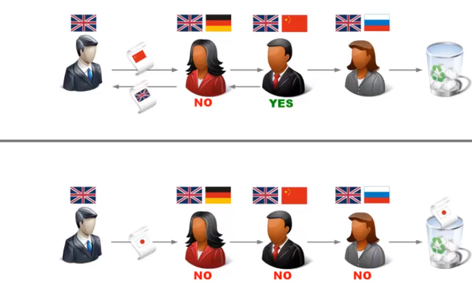
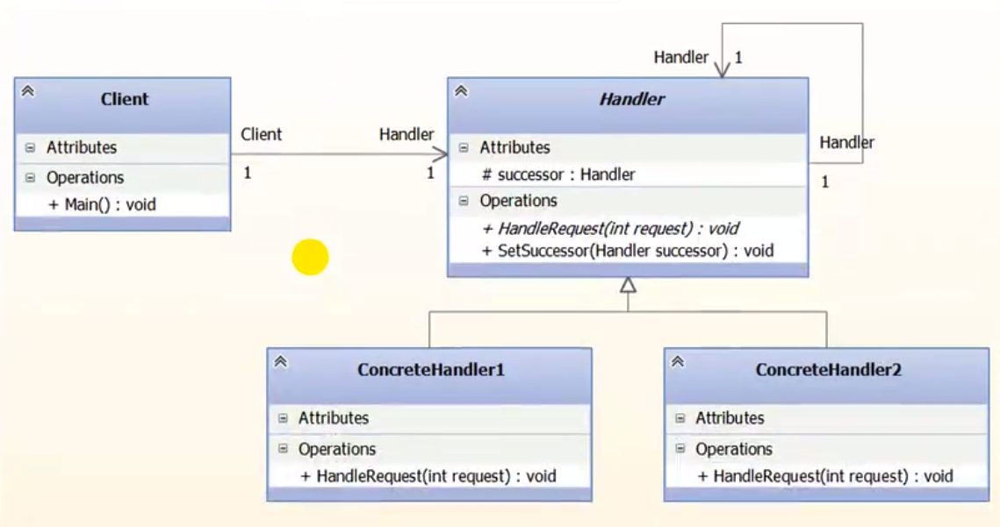
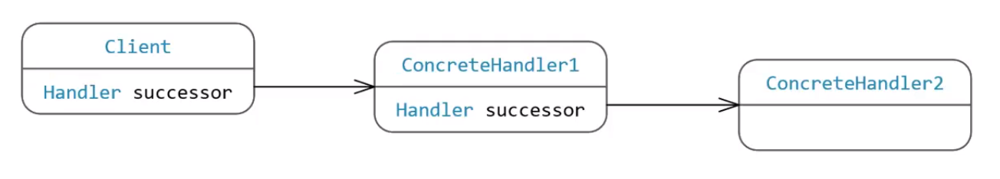

### Chain of responsibility

##### Метафора

Приходим в бюро переводов. По условиям, мы можем 
взаимодействовать только с одним переводчиком. Но
переводчики могут общаться друг с другом. 

В последнем случае (нижняя картинка), запрос теряется,
поскольку обработчика цепочки нет.

##### Суть паттерна 

Создает цепочку обработчиков запроса

##### Структура UML

##### Структура объектов

##### Применимость по GoF (стр 219)

 - Применять, когда есть более одного объекта, способного
обработать запрос, причем настоящий обработчик заранее
не известен и должен быть найден автоматически;

- Когда надо отправить запрос одному из нескольких 
объектов не указывая явно, кому именно;

- Когда набор объектов, способных обработать запрос
должен задаваться динамически. 

##### Достоинства 

- Ослабление связанности. Освобождает объект от 
геобходимости знать, кто конкретно обработает его запрос.
Отправителю и получателю ничего не известно друг о друге,
а включенном в цепочку объекту о структуре этой цепочки;

- Гибкость. Легко расширять систему;

##### Минусы

- Получение не гарантированно, поскольку у запроса нет
явного получателя. Следовательно, нет гарантии, что 
он будет обработан. Он может достичь конца цепочки и 
пропасть. Либо цепочка может быть сконфигурированна 
неправильно;

##### Назначение по GoF (стр 217)

Позволяет избежать привязки отправителя запроса к его
получателю, давая шанс обработать запрос нескольким
объектам.

Создает цепочки из обработчиков запросов. 

Если проводить аналогию с бюро переводов, то тут 
достоинство - саморегуляция. Можно жить без менеджера. 
Но это черевато другими проблемами. Простоем - клиент
ждет, пока закончат его перевод и блокирует всю цепочку.
Потому, такой подход в жизни редко применим.
