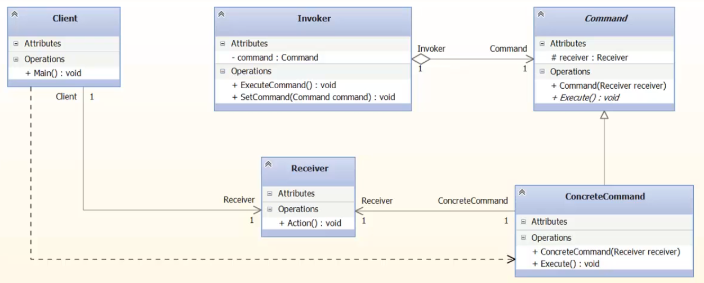

### Command

##### Метафора

Представляет запрос - как объект. Обычно запрос 
представляется в виде вызова метода. Зачем это нужно? 

Пусть мы в кафе или в ресторане. Подходит официант. 
Спрашивает, что мы будем заказывать. Мы отвечаем, 
официант все записывает на бумажку. И кладет эту бумажку 
повору в самый низ стопки таких же бумажек. Пусть, 
повар у нас один. Повор берет и поочередно обрабатывает
такие запросы. А бцмажка - это объект. То есть, раз 
за разом, запросы представляются как объекты. 
Такие запросы можно поставить в очередь. Можно отменить,
пока запрос еще не обработан.

##### UML 

Участники:

1. Invoker - официант;
2. Command - абстрактная бумажка с заказом;
3. ConcreteCommand - конкретная бумажка с заказом;
4. Receiver - повар. 

##### Применимость по GoF (стр 229)

- Когда нужно ставить в очередь запросы и выполнять в 
разное время. Можно сделать заказ у официанта, но 
попросить выполнить только тогда, когда придут друзья
например.

- Когда следует реализовать отмену операций (миграции бд).
Undo, Redo.

- Реализовать протоколирование изменений. Бумажки - заказы
- не только для повора, но и для отчетности в бухгалетрию.

- Структурировать систему на основе высокоуровневых
операций, построенных из примитивных. 

##### Назначение по GoF (стр 227)

Представляет запрос, как объект, позволяя клиенту 
конфигурироват запрос, ставить запросы в очередь,
протоколировать запросы, а также, поддерживает отмену
операций.

