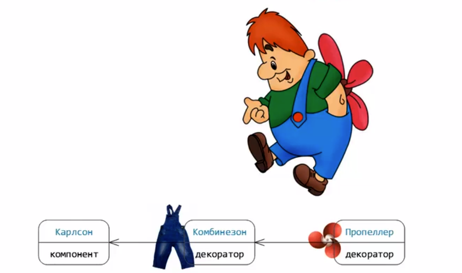
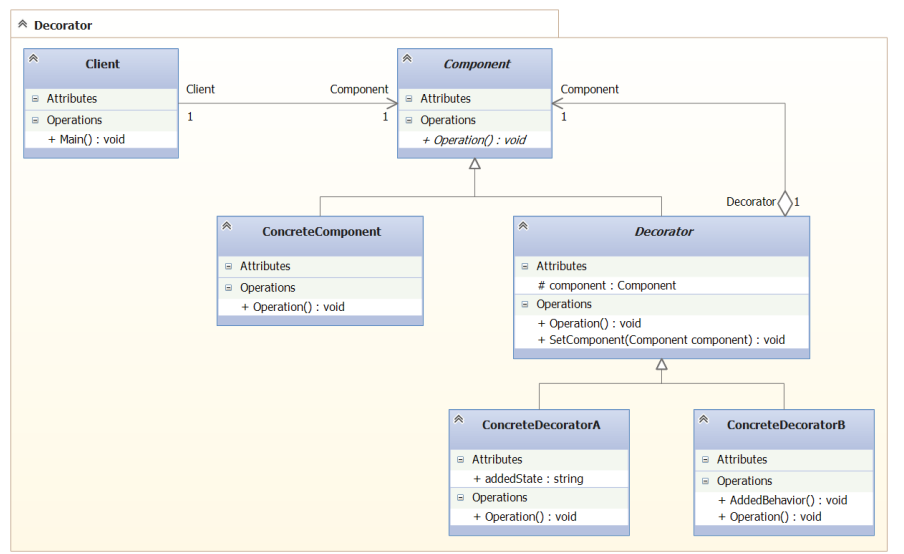

### Декоратор

Шаблон позволяет динамически добавлять состояние 
и поведение объекту во время его жизни. Дает возможность
расширить объект новой функциональностью, а позже эту 
функциональность убрать.

Для примера рассмотрим Карлсона. У него есть рубашка и
пропеллер. Рубашка - состояние, пропеллер - поведение.
Декорируем Карлсона ими и получаем некую летающую систему.

 
 
 В другой ситуации, например, если ему не нужно лететь,
 его можно декорировать только рубашкой.
 
 Живой пример декоратора из .NET - GZipStream. Ему в 
 качестве аргумента передаем FileStream. И работаем 
 мы с GZipStream, который, по сути - декорированный
 FileStream.
 
 #### Структура паттерна на языке UML
 
 
 
 где `ConcreteComponent` - Карлсон, 
 `ConcreteDecoratorA`/`ConcreteDecoratorB` - рубашка и
 пропеллер.
 
 > Компизиция, используемая в декораторе, является
> гибкой алтернативой наследованию с целью расширения
> функциональности. 

##### Минусы

Множество мелких объектов. При использовании нередко 
получается система, составленная из множества мелких
объектов, которые похожи друг на друга и различаются
только способом взаимосвязи. Тяжело изучать и отлаживать.

Это как женская косметика. Огромное количество всяких
баночек, кремов и т.д. Все это нужно применять в 
правильной последовательности.

#### Вывод

Декоратор отлично демонстрирует технику полиморфизма -
динамическая подмена во время выполнения состояния и 
поведения. 