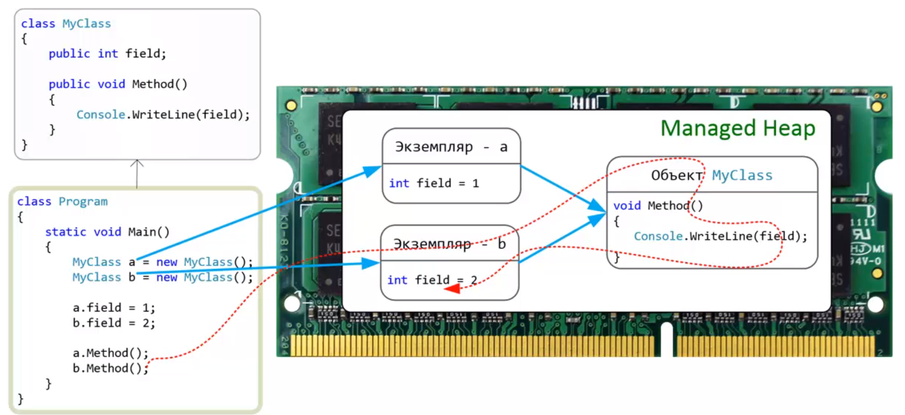
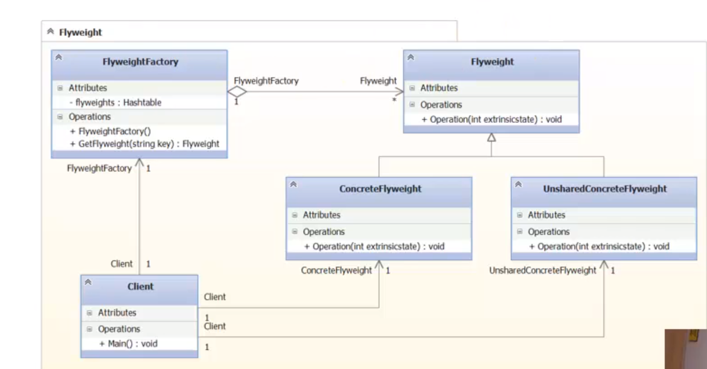
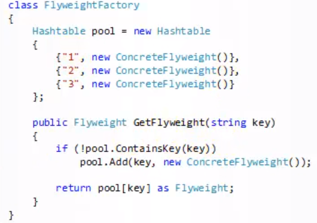

### Flyweight 

##### Метафора

Один актер играет сразу три роли в одном фильме. 
Причем, персонажи совсем не похожи. К каждой роли относится 
набор определенных аттрибутов, которые делают персонажа
уникальным. Каждая роль (костюм для роли) знает об актере.
То есть актер является Разделяемым объектом. Его разделяют
роли. Роль - не разделяемый объект, а актер - разедляемый
объект. С какой целью "разделяют" актера? С целью экономии
средств. Один актер дешевле трех. 


В приведенном примере, две роли (Доктор зло и Астиан Пауерс)
разделяют между собой одного актера Майка Майерса. 

##### Назначение
Организует Разделение объектов на Разделяемые и Не 
разделяемые. Где Разделяемый объект - объект, в который 
удобно вынести внутреннее состояние. 
(реализовано статикой в C# и других ЯП).
Организует работу с разделяемыми объектами.

##### Используется в .NET при работе с памятью

Нашел применение в .NET, служит для организации подсистемы
управления оперативной памятью, разделения программных
сущностей на экземпляры и объекты.



Пусть метод `Method` - очень большой и тяжелый. Для
оптимизации, в .NET разделяется объект на два понятия
Объект и Экземпляр

**Объект** - это область памяти в управляемой куче, 
которая содержит в себе методы и статические поля.

**Экземдляр** - область памяти, которая содержит в себе
только не статические поля.

При вызове метода, экземпляр передает соответствующую 
ссылку (на себя) объекту, далее производится вызов
метода объекта.

Метафора: экземпляры - роли, объект - актер.

##### Используется в .NET стандартной библиотеке

Например, пул интернирования строк. 

```c#
string a = "hello";
string b = "hello";
// это один и тот же экземпляр класса string

Console.WriteLine(ReferenceEquals(a, b));
```

##### Описание паттерна по GoF (стр 194)



По GoF просто так разделяемый объект создать нельзя.
Нужно его создавать через фабрику, так как он уникальны.
Вот примитивный пример такой фабрики:



Если такой Flyweight есть, то мы выдаем его по ключу.
Если нет, то создаем новый по переданому ключу.

##### Применимость по GoF

>Применять кода в приложении используется большое количество
одинаковым исходным состоянием. 

Но тут можно поспорит. 
Почему просто не использовать статический класс или 
синглтон? 

> Многие группы объектов можно заменить относительно
небольшим колличеством разделяемых объектов, поскольку
внешнее состояние вынесено.

Опять таки, это уже давно
везде реализовано. Есть статические поля. Делаем 
статическое поле и проблема, описанная в GoF решена!
