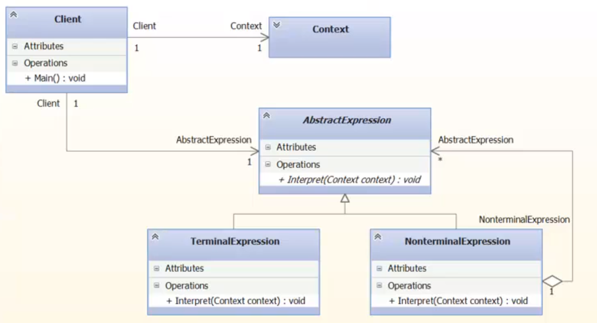

### Interpreter

Для заданного языка (автоматного) описывает объектно -
ориентированное представление его грамматики. 
Является механизмом толкований предложений языка. 
Проверяется, автоматный ли язык, при помощи Леммы о 
накачке. 

##### UML

- AbstractExpression - абстрактное выражение;
- TerminalExpression - ключевое слово языка;
- NonterminalExpression - то, что не представляет 
слово. (Часть слова, например).

##### Применимость (GoF стр 238)

Формирует объектно ориентированное представление 
грамматики. 

> Использовать, когда есть язык для интерпретации,
> предложения которого можно представить в виде 
> абстрактных синтаксических деревьев. Лучше 
> всего этот паттерн работает, когда граматика проста.
> Для сложных грамматик иерархия класса становится 
> неуправляемой. Ни для человека, ни для машины.
> В таких случаях применяют Генераторы синтаксических
> анализаторов, поскольку они могут интерпретировать
> выражения не строя объектно-ориентированных 
> представленйи абстрактных синтаксических деревьев,
> что экономит память. 

##### Достоинства и недостатки (GoF стр 240)

Достоинства: 

- Грамматику легко изменять и расширять;
- Простая реализация грамматики; 

Недостатки:
- Сложные грамматики невозможно сопровождать.

##### Назначение (GoF стр 236)

> Для заданного автоматного язка определяет 
> объектно-ориентированное представление его грамматики.
> Также реализует механизм толкования цепочек.

