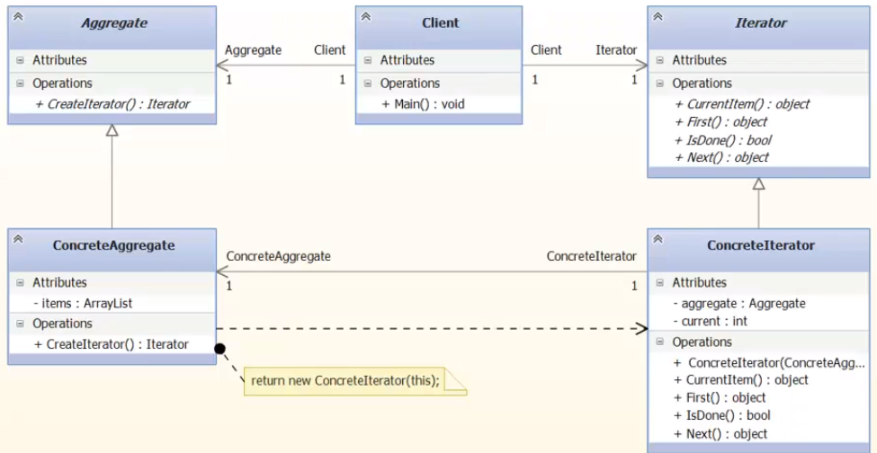
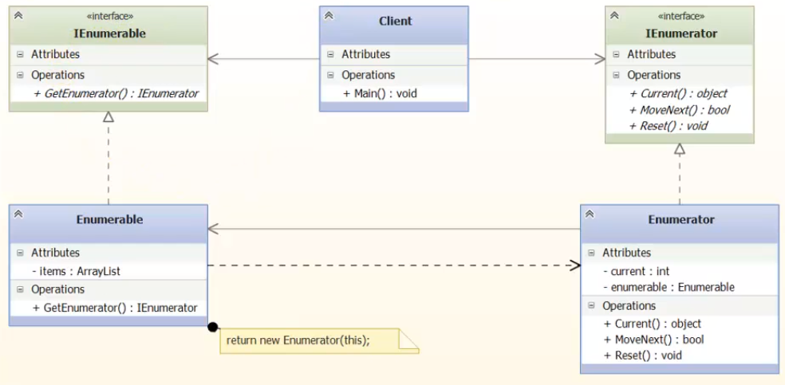

### Iterator 

Итератор - специльный объект, обеспечивающий безопасный 
доступ к коллекции, чтоб клиент работал с простой оберткой
и ничего не поломал. 

Этот паттерн не используется в .NET. Вместо этого, 
Майкрософт предложили свой паттер Enumerator. 

##### UML Iterator в классическом (по GoF) представлении

##### UML Iterator Microsoft

