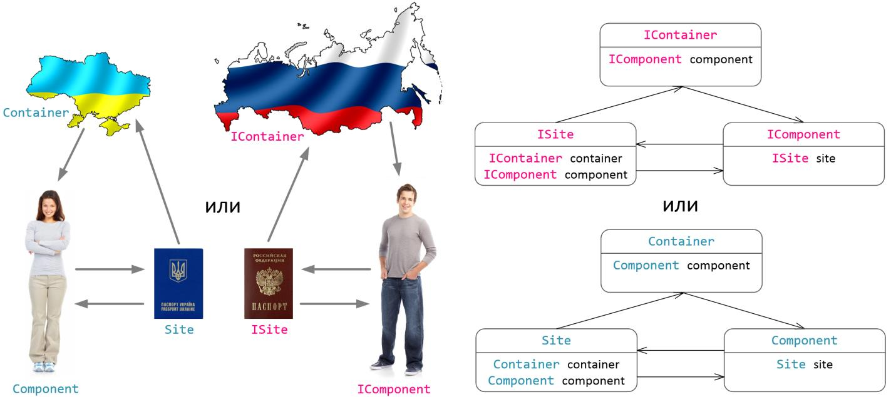
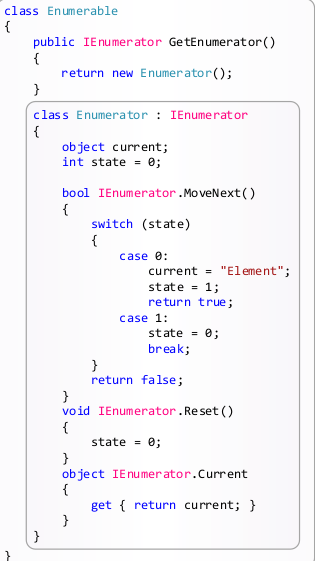

### Iterator (или Cursor)

##### Метафора
Рассмотрим банк. Банк - это коллекция денег. Мы не можем самостоятельно 
зайти в бансковское хранилище, взять или положить сколько то денег. 
Это не безопсно ни для нас, ни для банка. Потому, банк предоставляет
специальные объекты - кассиры. Они же и есть итераторы. 

Коллекции создавались не только для того, чтобы оборачивать массивы
в коллекции. Данные внутри коллекции могут храниться в любой структуре.
Например, в дереве. Потому, тем более нельзя клиенту давать прямой доступ
к структуре, в которой хранятся данные. 

Итератор - специльный объект, обеспечивающий безопасный 
доступ к коллекции, чтоб клиент работал с простой оберткой
и ничего не поломал. 

Этот паттерн не используется в .NET. Вместо этого, 
Майкрософт предложили свой паттер Enumerator. 


##### Описание канонических программынх коллекций  

Источник: [Википедия](https://ru.wikipedia.org/wiki/%D0%9A%D0%BE%D0%BB%D0%BB%D0%B5%D0%BA%D1%86%D0%B8%D1%8F_(%D0%BF%D1%80%D0%BE%D0%B3%D1%80%D0%B0%D0%BC%D0%BC%D0%B8%D1%80%D0%BE%D0%B2%D0%B0%D0%BD%D0%B8%D0%B5)

Коллекция — программный объект, содержащий в себе, 
тем или иным образом, набор значений одного или различных типов, 
и позволяющий выполнять определенные действия с этими объектами 
(читать, добавлять удалять и тд).

В зависимости от того, как логически организован доступ к 
данным коллекции, выделяются следующие основные типы:

- Вектор —  элементы коллекции упорядочены, каждый имеет собственный номер, 
называемый индексом, по которому к нему можно в любой момент обратиться. 
Как правило, в качестве индексов выступают последовательные целые числа 
либо значения, приводимые к ним. Для обращения к элементу вектора используется 
имя вектора и значение индекса. При добавлении нового элемента он добавляется 
либо в конец вектора, либо в позицию с заданным индексом. Удаление элемента 
из вектора приводит к образованию пустого элемента.


- Матрица — элементы имеют два упорядоченных индекса, каждый из которых является
 целым числом. Для доступа к элементу нужно указать имя матрицы и оба индекса.
 Новый элемент может быть добавлен только в позицию с заданной парой индексов. 
 Удаление приводит к оставлению пустого элемента.
 
- Список — элементы коллекции упорядочены, идентификаторов у элементов нет. 
Список — коллекция с последовательным доступом. В любой момент доступен 
первый элемент коллекции (обычно также доступен и последний). 
От любого элемента коллекции можно получить доступ к следующему по порядку, 
таким образом, можно последовательно дойти от первого элемента списка до любого 
желаемого. Возможна реализация, допускающая обратный проход (к предыдущему элементу
от известного). Новый элемент может добавляться в начало или в конец списка. 
При удалении элемента из начала списка первым элементом становится следующий за ним,
при удалении из конца — предыдущий, из середины — предыдущий и последующий 
элементы становятся, соответственно, предыдущим и последующим один для другого. 

- Стек — коллекция, реализующая принцип хранения «LIFO» («последним пришёл —
первым вышел»). В стеке постоянно доступен только один элемент — тот, который
был добавлен последним. Новый элемент может быть добавлен в стек, он станет
текущим. Текущий элемент всегда можно удалить («взять») из стека, после 
этого становится доступен элемент, который был добавлен непосредственно 
перед ним.

- Очередь — коллекция, реализующая принцип хранения «FIFO» («первым пришёл — 
первым вышел»). В очереди постоянно доступен только один элемент — тот, 
который был добавлен самым первым из имеющихся.

- Ассоциативный массив (словарь) — неупорядоченная коллекция, хранящая пары
«ключ — значение». Доступ к элементам производится по ключу. В качестве 
ключа могут использоваться значения различных типов, единственное ограничение — 
тип ключа должен допускать сравнение на равенство. Любая пара может быть в 
любой момент удалена. Добавляться может только пара (с определённым ключом).
Может вводиться запрет на дублирование ключей в коллекции. Если такого 
ограничения нет, то при обращении по дублирующемуся ключу может выдаваться 
либо n-е найденное значение (где n либо постоянно, либо определяется формой 
запроса), либо все значения с данным ключом.

- Множество — неупорядоченная коллекция, хранящая набор уникальных значений и 
поддерживающая для них операции добавления, удаления и определения вхождения.
Как правило, для множеств поддерживаются операции, аналогичные операциям с 
математическими множествами: объединение, пересечение.

##### Операции над коллекциями 

- Для всех видов коллекций — объединение. Результатом такой операции становится 
коллекция того же типа, что и операнды, содержащая все элементы, содержащиеся в 
операндах.

- Для векторов и матриц, содержащих числовые значения — типичные математические
операции над одноимёнными объектами: сложение, вычитание, умножение, 
транспонирование.

- Для векторов — извлечения диапазона индексов. Результатом такой операции будет 
вектор того же типа, содержащий только те элементы исходного, которые попадают в
некоторый заданный диапазон.

- Для векторов и списков — сортировка. 

- Для множеств — объединение, пересечение, разность и симметричная разность.

##### Метафора про банк с точки зрения реализации от Майкрософт.

`IEnumerable` - банк, `IEnumerator` - кассир.

##### Контейнер и коллекция

В информатике контейнер представляет собой разновидность (настраиваемый класс) коллекции.
Контейнер содержит в себе специальные объекты-компоненты. Контейнер управляет внутренним
взаимодействием компонентов друг с другом (внутри контейнера), а также контролирует взаимодействие
внутренних компонентов с другими (внешними) объектами, находящимися за пределами контейнера.
Другими словами, контейнер – это связующее звено между компонентами, содержащимися в этом
контейнере и внешними объектами из кода приложения. Внешние объекты могут получить ссылки на
компоненты, содержащиеся в контейнере, не зная настоящего имени этого компонента.

Для того чтобы правильно создать пользовательский контейнер и наполнить его компонентами,
потребуется воспользоваться тремя интерфейсами IContainer, IComponent и ISite. Или
воспользоваться напрямую или через наследование готовыми классами контейнера Container и
компонентов Component, которые идут в поставке .Net Framework. Доступ к компонентам, содержащимся в
контейнере, можно получить с помощью свойства ComponentCollection Components этого контейнера.

Для лучшего понимания идеи совместного использования контейнера Container и компонентов
Component предлагается воспользоваться метафорой. Контейнер - Container (IContainer) можно
проассоциировать со страной, в которой проживает человек – Component (IComponent), у которого
имеется паспорт - Site (ISite) в котором указано имя человека и гражданство (принадлежность к стране).



Объект типа Site (ISite) предоставляет дополнительное удобство для работы с компонентами.
Например, в давние времена не было паспортов и некоторым людям (рабам) ставили клеймо на теле с
именем и принадлежностью. Конечно такой подход не удобен.

Вывоод: контейнер - коллекция для компонентов, где компонент - сложный,
тяжелый в настройке объект.

##### Подробнее про интерфейсы коллекций

Реализация интерфейсов IEnumerable и IEnumerator не дает нам коллекцию 
в полном смысле слова. Дает лишь, так называемый Составной объект. 
Рассмотрим эти интерфейсы: 

```c#
interface IEnumerable
{
    IEnumerator GetEnumerator();
}
```

```c#
interface IEnumerator
{
    bool MoveNext();
    void Reset();
    object Current { get; }
}
```
Чтобы сделать это коллекцией, надо реализовать интерфейс `ICollection`

```c#
public interface ICollection : IEnumerable
{
    int Count { get; }
    bool IsSynchronized { get; }
    object SyncRoot { get; }
    void CopyTo(Array array, int index);
}
```

Для создания списка, нужно реализовать еще более высокоуровневый интерфейс - `IList`

```c#
public interface IList : ICollection
{
    bool IsFixedSize { get; }
    bool IsReadOnly { get; }
    object this[int index] { get; set; }
    int Add(object value);
    void Clear();
    bool Contains(object value);
    int IndexOf(object value);
    void Insert(int index, object value);
    void Remove(object value);
    void RemoveAt(int index);
}
```

##### Yeild

Это оператор автоматической генерации программного кода итератора
(инумератора). Задача оператора yield сгенерировать
(написать без участия человека) программный код класса итератора для 
того объекта в котором он
используется. Оператор yield облегчает работу программиста, 
избавляя его от необходимости вручную
писать код класса итератора. При этом сама реализация класса 
итератора оказывается скрытой от
программиста,


```c#
class Enumerable
{
    public IEnumerator GetEnumerator()
    {
        yield return "Element";
    }
}


class Program
{
    static void Main()
    {
        Enumerable enumerable = new Enumerable();
   
        foreach (var item in enumerable)
        {
            Console.WriteLine(item);
        }
    }
}
```

`Yield` делает вложенный класс. Вот пример того, что генерируется на самом деле:



##### UML Iterator в классическом (по GoF) представлении


##### UML Iterator Microsoft


##### Внешний и внутренний итератор

Внешний итератор - когда итерацией управляет клиент;

Внутренний итератор - когда итерация происходит автоматически и клиент ничего не придпринемает.

При работе с внешним итератором, клиенты должны явно запрашивать следующий элемент чтобы 
двигаться дальше по коллекции. 

В случае использования внутренноего итератора - клиент передают итератору лямбду, 
а итератор уже сам применяет ее к каждому посещенному элементу коллекции. 

Пример использования внутреннего итератора 

```c#
class Program
{
    static double Power2(double n)
    {
        return Math.Pow(n, 2);
    }
        static void Main()
    {
        Enumerable enumerable = new Enumerable();
        IEnumerable power2List = enumerable.Transform(new Function(Power2));
        
        foreach (var item in power2List)
            Console.WriteLine(item);
    
        IEnumerable power3List = enumerable.Transform(n => Math.Pow(n, 3));

        foreach (var item in power3List)
            Console.WriteLine(item);
    }
}

class Enumerable
{
    List<double> list = new List<double> { 1, 2, 3, 4 };
    
    public IEnumerable Transform(Function function)
    {
        foreach (double item in list)
        yield return function(item);
    }
}
```

##### Назначение паттерна по GoF (стр 249)

Предоставлет способ последовательного доступа ко всем элементам составного объекта. 

##### Полиморфный итератор

Итератор, который может работать с разными коллекциями.