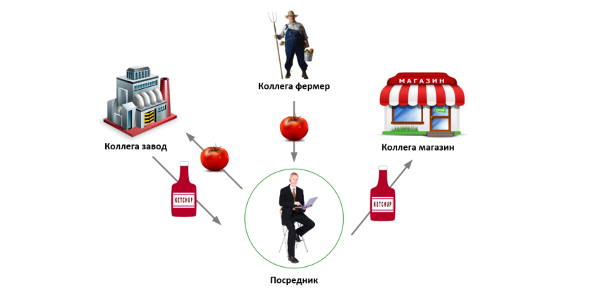
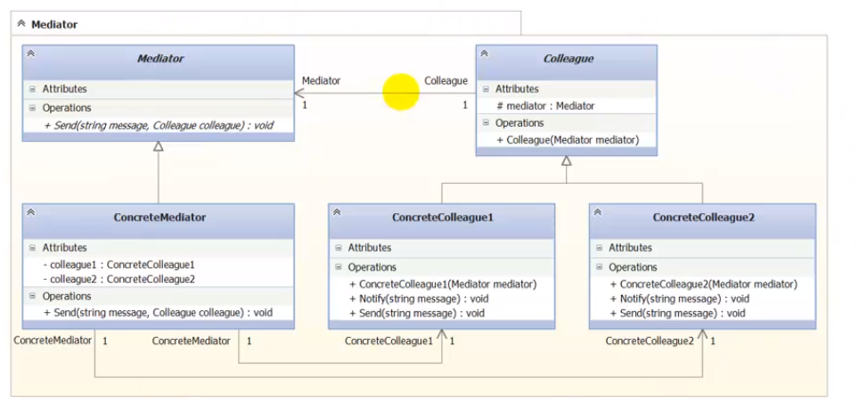

### Mediator

##### Метафора

На картинке изображен Посредник. Человек, у которого бизнес.
Спикулянт. Он скупает помидоры у фермеров, продает их 
на завод, на заводе закупает кетчуп и поставляет его в магазин.
Данный человек приносит пользу. Фермеры получают те же
деньги, как они бы продавали бы эти памидоры сами, но им 
не нужно думать об источнике сбыта. Их задачей остается только
выращивать помидоры. Для завода выгода в том, что не нужно
искать откуда брать помидоры. Посредник придет и все устроит.
Для магазина тоже выгода. Посредник все поставит и 
проконтролирует наличие. 

##### UML ()

##### Назначение

Предоставляет объект-посредник. 

##### Результаты по GoF (стр 267)
 
Достоинства:

- Снижает число пораждаемых подкласов;
- Устраняет связанность между коллегами;
- Упрощает протокол взаимодействия между коллегами;
- Абстрагирует способ совместной работы.

Минусы:

- Централизует управления. Медиатор очень сложный.
Может стать монолитом, который сложно сопровождать.

##### Назначение по GoF (стр 263)

Предоставляет объект-посредник, который скрывает способ
взаимодействия множества других объектов-коллег. Поддерживает
слабую связанность системы, избавляя объектов-коллег от 
необходимости явно ссылаться друг на друга и позваляя тем
самым легко добавлять новго коллегу и изменять взаимодействие.
