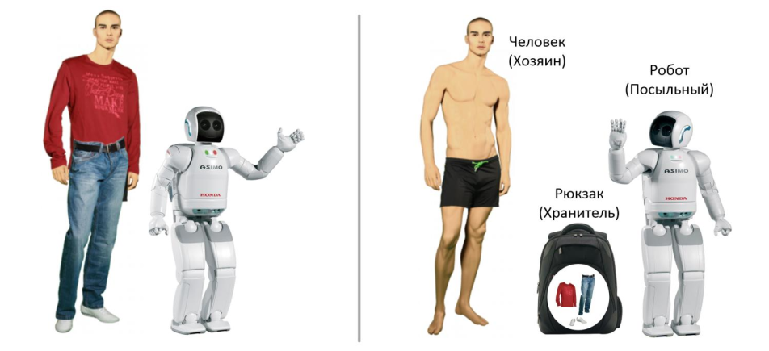
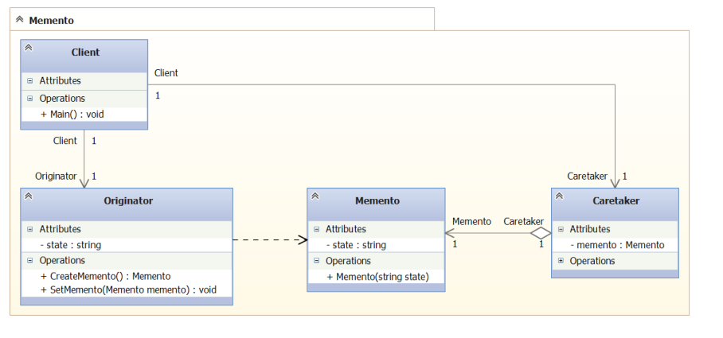
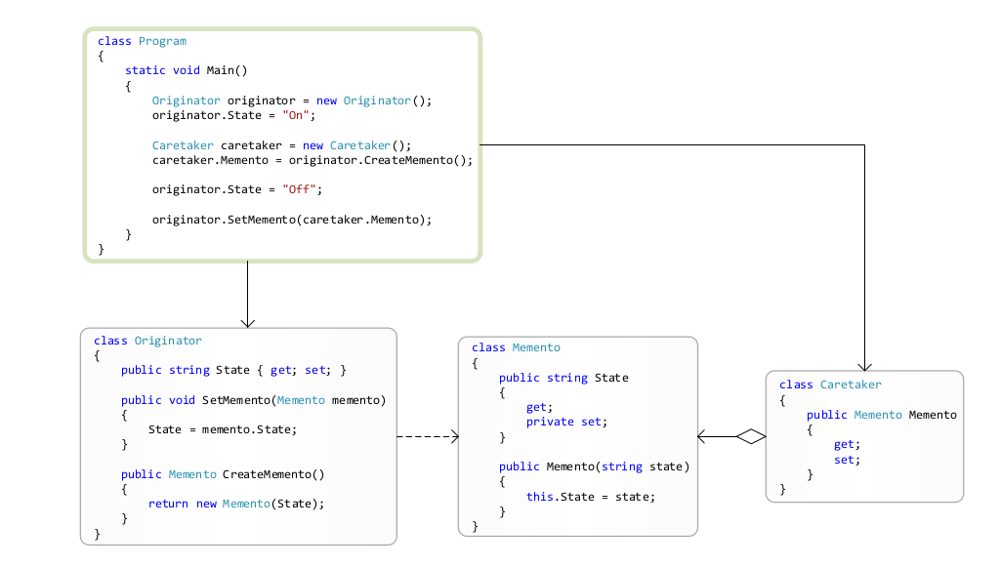

### Momento

##### Метафора 

Пусть мы преобрели робота-помошника, как на картинке ниже:

Пусть мы пришли на пляж и решили искупаться. Переодеваемся, 
убираем в рюкзак свои вещи и отдаем рюкзак роботу. Мы купаемся, 
идем назад к роботу, берем свои вещи и одеваемся. Тут стоит 
заметить один момент. Разработчики не научили робота открывать
рюкзак и лазить по нему самостоятельно. 
Итого, в данной метафоре у нас есть три действющих лица.

- Мы. Мы хозяева своего состояния (одежда на нас); 
- Рюкзак - хранитель нашего состояния. Туда мы складываем
нашу одежду - наше состояние;
- Робот-посыльный. Держит наше состояние (рюкзак с одеждой). 

##### UML

 

- Originator - хозяин;
- Memento - хранитель;
- Caretaker - посыльный.

##### Применение (GoF стр 274)

Использовать тогда, когда необходимо создать снимок
текущего состояния объекта, чтоб потом восстановить
состояние из этого снимка. 

Подойдет, например, для сохранения состояния конечного автомата.

##### Отношения (GoF стр 275)

Caretaker не имеет никакого доступа к Memento. Этого можно
достигнуть потем передачи для Caretaker Memento с узким 
интерфейсом, покуда хозяин имеет Memebto с щироким. 

##### Назначение (GoF стр 272)

Не нарушая инкапсуляции, выносит за пределы объекта его 
внутреннее состояние так, чтобы позднее это состояние
можно было восстановить в исходном объекте хозяина. 

Предоставляет объект для хранения состояния. Может пригодиться
в состемах автоматного типа. 

Хотя объект можно просто сереиализовать и не париться. 
Но memento может хранить не все состояние, а часть состояния.