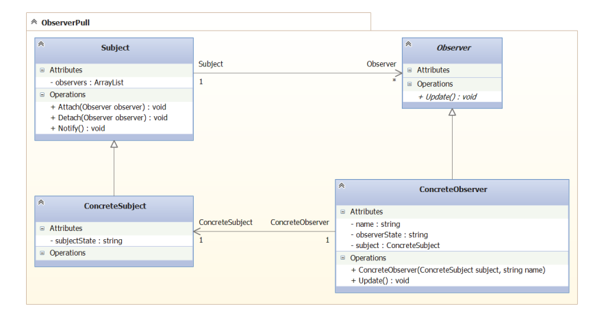
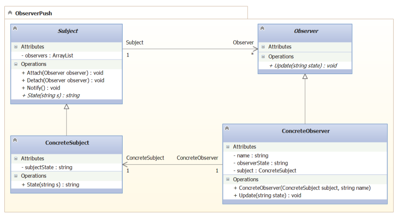

### Observer

В .NET не используется, поскольку в .NET есть своя организация
событийной модели. 

##### Метафора 

Есть издатель, есть подписчики. Издатель издает, например, журналы.
На определенный журнал, подписываются люди. Когда журнал 
выходит, он доставляется подписчикам. Есть две модели доставки
журнала: 

1) Модель проталкивания. Когда почтальен подходит к дверям
и забрасывает журнал в почтовую щель. Хотим мы этого или нет,
мы этот журнал получим;
2) Модель вытягивания. Когда нам приходит просто квитанция.
А в ней говорится, чтоб мы пришли и забрали журнал у издателя.
Можем забрать, а можем и не забирать.

##### UML модель вытягивания 

Subject - издатель. Observer - подписчик. 
У подписчика есть метод Update(), который в данном случае, 
ничего не принимает, ничего не возвращает. Через его вызов
подписчик лишь уведомляется о том, что событие произошло. 
А результат подписчик может забрать, может не забирать. 
 
##### UML модель проталкивания

 

Тут метод Update уже имеет аргумент. И хотим мы или нет, 
издатель передаст нам состояние. 

##### Применимость по GoF (стр 282)

- Когда при изменении одного объекта, нужно изменить другие
объекты. Причем, неизвестно, сколько других объектов нужно
изменить;

##### Примечание

Хотя техника делегатов в .NET и избавила нас от необходимости
реализации данного паттерна, Microsoft все равно оставили нам 
интерфейсы `IObserverable<T>` и `IObserver<T>` на всякий случай.

##### Назначение (GoF стр 280)

Определяет зависимость типа один-ко-многим между объектами
таким образом, что при изменении состояния объекта-издателя,
все зависящие от него подписчики оповещаются об этом и 
автоматически обновляются. 

Осуществляет технику Издатель-Подписчик. 

 