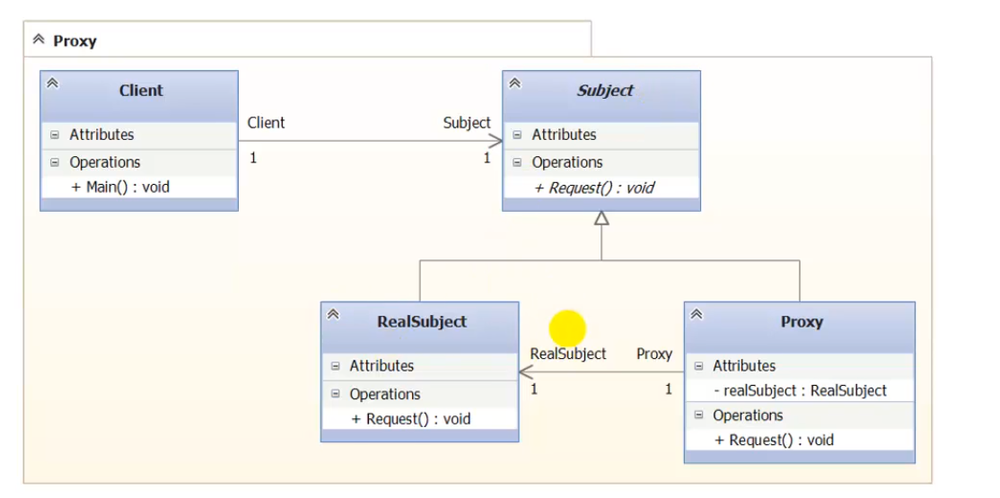

### Proxy

##### Метафора

Фильм Сурогаты лучше всего описывает данный паттерн.
Суть в следующем. У нас есть оригинал - Субъект и его
заменитель - Сурогат. Интерфейсы сурогата (прокси) и 
субекта совпадают.

Главная цель паттерна - предоставить объект заместитель.
Этот заменитель пропускает через себя весе запросы
к объекту. Может что то фильтровать например.

У этого паттерна есть 4 разновидности. (GoF 205)

> Применим во всех случаях, когда к объекту нужно 
> сослаться не прямо, а косвенно. 

Ситуации, когда прокси полезен

- Удаленный заместитель. Представляет локального 
представителя вместо объекта, находящегося в другом
адресном пространстве. Например WCF.

- Виртуальный заместитель. Создает тяжелые объекты 
по требованию. Например, лента в ВК при прокрутке.
Изобразения загружаются как только определенная новость
попадает в область экрана. До этого, мы видим некую
замену картинки, ее очень низкокачественный размытый 
вариант.

- Защищающий заместитель. Защищает объект от прямого 
доступа. Пусть, у нас есть объект с разными правами
доступа. 

- Умная ссылка. Позволяет выполнить некие дополнительные
действия при доступе к объекту. 

##### Назначение

Являться сурогатом другого объекта и контролировать 
доступ к нему.

