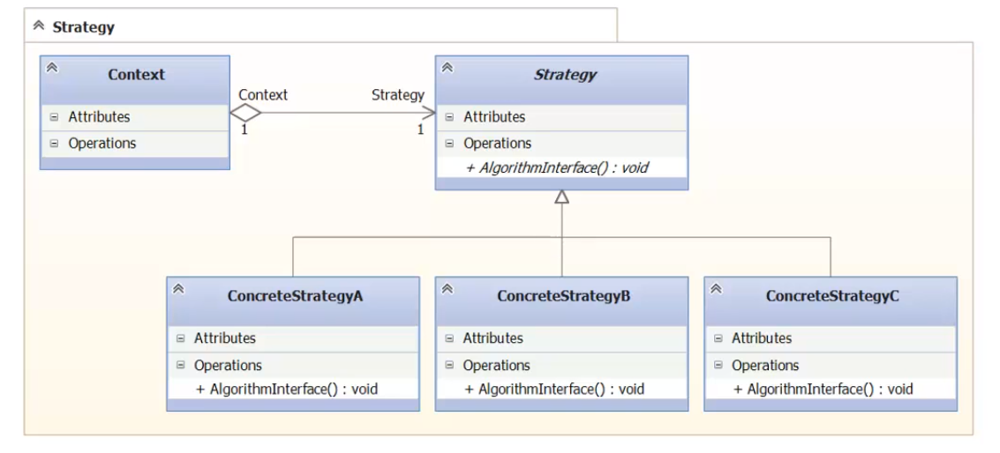
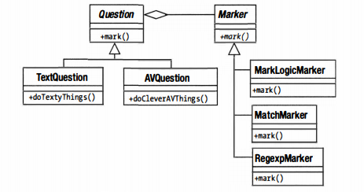

### Strategy

**Стратегия в жизни** - некий план действий, совокупность
шагов для достижения поставленной цели. 

Вместо того, чтоб плодить иерархию наследования, 
раскидываем функциональность по классам. Такие классы и есть
- стратегии. Пользователь в клиентском коде выбирает нужну
стратегию. 

##### UML 

где контекст - по сути - клиентский код. Каждый раз 
контекст конфигурируется нужно стратегией, в зависимости от 
того, как он хочет достичь результата. 

##### Пример из жизни

Пусть у нас есть некая викторина. Соответственно, есть класс
`Question` и в нем метод `mark()`. Это все хорошо, пока не 
понадобится поддерживать различные механизмы оценки. 
От идеи создать подклассы - лучше отказаться. По началу 
это поможет, но вдруг - оценка перестанет быть единственным
меняющимся аспектом класса. Например, у нас появятся разные
типы вопросов. Придется наследовать класс `Question`
и функционал оценок. Он может повторяться для разных 
вариантов вопросов.  
Тут будет провал всей иерархии наследования. 

Когда класс должен поддерживать несколько интерфейсов, 
то лучший подход - выделить эти реализации и поместить их 
в собственные классы, а не расширять первоначальный класс.

- Question - контекст;
- абстрактный Marker - стратегия;

##### Назначение (GoF 300-301)

**Описывает способы подмены алгоритмов (стратегий).**

Определяет набор алгоритмов, скрывает каждый из этих алгоритмов,
делает их взаимозаменяемые. Позволяет подменять алгоритмы
независимо от клиентов, которые ими пользуются. 

Использовать, вместо длинной запутанной иерархии наслодования,
созданной с целью иметь различные варианты одного алгоритма.  

Пусть, есть два варианта алгоритма, где первый - требует
больше процессорного времени, второ - больше оперативной 
памяти. Стратегия отлично подходит для данной ситуации.

Также позволяет скрывать сложную реализацию алгоритмов 
от клиентов. 

Помогает, когда в классе определено много вариантов поведения,
представленных условными операторами. Тут лучше перенести
код из ветви в отдельные стратегии. 

##### Достоинства

- Альтернатива порождению подклассов;
- Выбор реализации;

##### Минусы

- Клиент должен знать о конкретных стратегиях.

