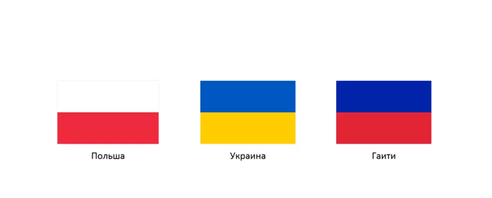
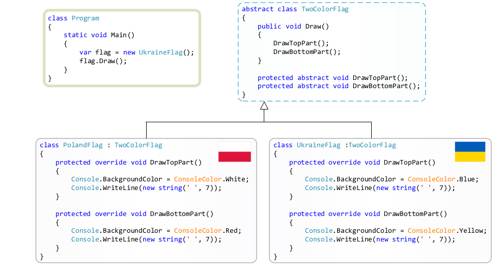
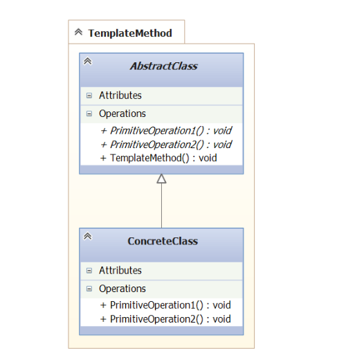

### Template method

Это паттерн уровня классов. 

##### Метафора

Дано три двухцветных флага: 

Задача - создать двухцветный флаг. Как это сделать? 
Можно вызвать метод. Этот метод внутри себя вызывает 
два других метода: 

Замечание! В абстрактном классе мы вызываем абстрактные методы.
Это проявление техники Абстрагирования вариантов использования.

Здесь метод `Draw()` и есть шаблонный метод. Он инкапсулирует
в себе шаги алгоритма - печать верхней части и печать нижней 
части.

Здесь конкретные реализации пердставляют собой низкоуровневый
алгоритм. А в методе `Draw()` высокоуровневый алгоритм, 
состоящий из абстрактных вызовов. По сути `Draw()` - это 
шаблон. Под него реализуется конкретный алгоритм. 

##### UML 

- TemplateMethod - это был метод Draw() из метафоры;
- PrimitiveOperation1() и PrimitiveOperation2() - это были 
DrawTopPart() и DrawBottomPart().

##### Применимость (GoF 311)

- Паттерн Шаблонный метод следует использовать чтобы использовать
неизменяющиеся части алгоритмов, оставляя реализацию 
изменяющегося поведения на усмотрение подклассов;

- Когда нужно в одном классе собрать поведение, общее для 
всех подклассов, чтобы избежать дублирования кода;

##### Назначение 

Формирует структуру алгоритма.  