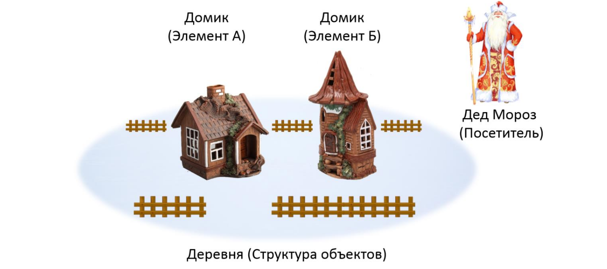
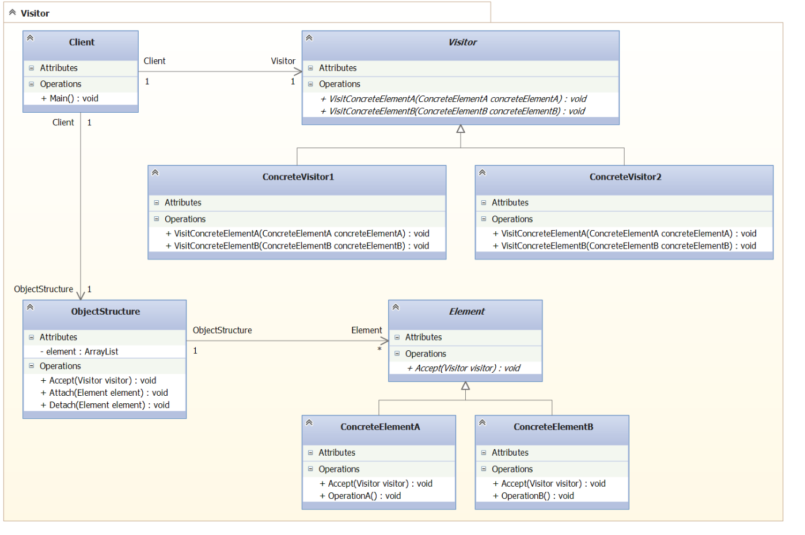

### Visitor

##### Метафора

Представим деда-мороза. Он обходит дома в некой деревне и раздает подарки. Каждый заказывает
свой подарок. Кому то игрушку, кому-то платье и т д. Деревня - это гетерогенная коллекция.
Например ArrayList, где в каждом доме нужно подарить какой то свой тип подарка. Паттерн visitor 
как раз и обеспечивает возможность обхода таких гетерогенных коллекций и одинакового обслуживания
их объектов с разными интерфейсами взаимодействия. 

##### UML 

##### Двойная диспетчеризация (GoF стр 321)

Visitor позволяет не изменяя классы, добавлять в них новую функциональность.  То есть, расширение
для класса лежит в визиторе.  НО, в C# есть расширяющие методы. Так что надобность в этом паттерне 
в рамках C# сомнительна. Все расширяющие методы - и есть визиторы. 

##### Назначение

Обходит набор элементов с разнородным интерфейсом. 
Без необходимости приводить их к общему типу.
Также позволяет добавить новые методы в класс объекта при этом не изменяя класс объекта. 
